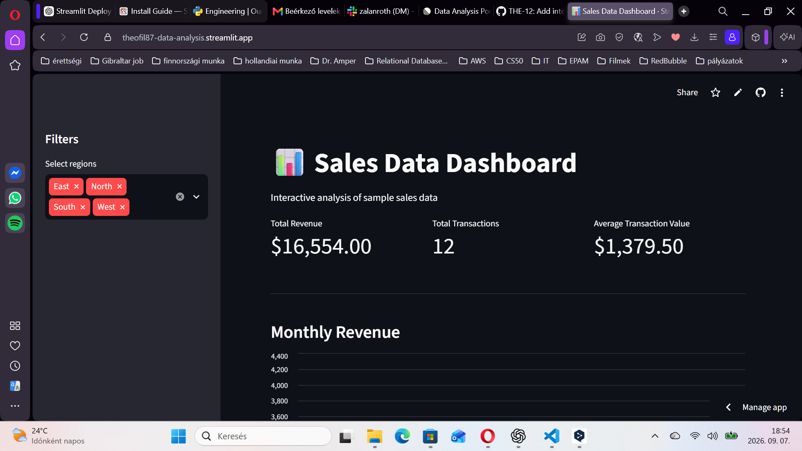

# 📊 Sales Data Dashboard

An interactive data analytics dashboard built with Python and Streamlit.

The application allows users to explore sales performance through interactive filters, KPI metrics, and visualizations.

## 🚀 Live Demo

🔗 https://theofi187-data-analysis.streamlit.app

## Dashboard Preview



## 📌 Features

- Interactive region filtering
- Total Revenue KPI
- Total Transactions KPI
- Average Transaction Value KPI
- Monthly Revenue visualization
- Interactive sales data exploration

## 🛠 Technologies Used

- Python
- Pandas
- Streamlit
- Plotly
- Git
- GitHub

## 📂 Project Structure

```text
data-analysis-portfolio/
│
├── app.py                 # Streamlit dashboard application
├── src/
│   ├── analysis.py        # Data analysis functions
│   └── generate_data.py   # Sample data generation
│
├── data/                  # Dataset
├── notebooks/             # Exploratory analysis
├── tests/                 # Automated tests
├── requirements.txt       # Project dependencies
├── pyproject.toml         # Project configuration
└── README.md


